# Property Map — first-reference mind map

Read this before opening implementation files. It is an index to the code, not a replacement for checking the named source before changing behavior.

```mermaid
mindmap
  root((Property Map))
    Product
      Portfolio workspace
      Projects contain properties
      Country and region maps
      Filters search and directory
      Custom fields palettes and editable map legends
      PDF PNG ZIP CSV and JSON exports
    Runtime choices
      Standalone browser preview
        Property-Map.html
        Built by build_preview.py
        All assets and geography embedded
        Projects and config in localStorage
        Export bytes in IndexedDB
        Single local admin identity
      Python server local mode
        python server.py
        Loopback only
        SQLite under data by default
        Automatic local admin identity
      Python server shared mode
        PROPERTY_MAP_MODE shared
        Email and password sessions
        Project ACLs enforced server side
        Persistent PROPERTY_MAP_DATA required
        Intended behind HTTPS proxy
        Dockerfile entry point
      GitHub Pages
        github workflows pages.yml
        Publishes the standalone preview on every push to main
    Browser application
      public index.html
        Loads pinned vendor libraries and Material Symbols icon paths
        Loads export-engine.js then app.js
      public app.js
        Central state object S
        API adapter selects browser or server storage
        Render functions return HTML strings
        Delegated click change submit handlers
        D3 and TopoJSON map drawing
        Drawers for edit settings sharing and export
        Team and access screen for shared-mode administrators only
        Icons are Material Symbols from public vendor material-symbols.js
        Backup import and CSV download
      public styles.css
        Design tokens for spacing type colour radius and icon size
        Rules in docs UI_STANDARDS.md
        Responsive and mobile layout
        Dialog and drawer styling
      public export-engine.js
        Sorts export rows
        Measures unwrapped column widths
        PDF map plus directory pages
        Paginated PNG or ZIP
        Single-image poster PNG
        Browser pixel and edge limits
    Server application
      server.py
        Standard-library HTTP server
        Static public file serving
        JSON API routing
        SQLite persistence
        PBKDF2 password hashing
        Hashed expiring sessions
        Same-origin mutation guard
        Validation ACL filtering and conflicts
      SQLite tables
        users
        sessions
        projects as JSON documents
        config as one JSON document
        exports as blobs
        audit
      API
        POST login and logout
        GET bootstrap
        PUT config
        GET and POST users
        POST atomic project import
        POST projects
        PUT and DELETE project by id
        PUT project members
        POST project exports
        GET and DELETE export bytes
    Domain model
      Project
        Identity owner members and version
        Name description team and home country
        Properties
        Project custom fields
        Palette and map legend definitions
        Region-to-legend rules
        Export metadata
      Property
        Name and unique project code
        Country state district city and address
        Live or Opportunity status
        Project map legend reference
        Team notes and competitor flag
        Paired optional latitude and longitude
        Custom values keyed by field id
      Custom field
        Text number date select or checkbox
        Required and optional status condition
        Visibility and edit role rules
        Account then team then project precedence
        Locked account fields cannot be overridden
      Map legend
        Stable project-local ID
        Editable unique label and color
        Assigned to properties or country regions
        Deletion reassigns existing uses
      Access
        Admin or owner has project admin access
        Contributor edits permitted project data
        Viewer reads and exports
        No membership means no project access
    Geography
      public data countries.json
        Country index
      public data three-letter-code JSON
        Natural Earth admin level one GeoJSON
      public data us-counties.json
        US states and counties TopoJSON
      prepare_data.py
        Simplifies raw Natural Earth boundaries
      normalize_geo.cjs
        Corrects polygon winding for D3
      Limitations
        Non-US districts are manual text
        Coordinates are not geocoded
        Coordinates are not polygon-validated
    Seed and generated artifacts
      seed.py
        Default config and palettes
        US sample with 44 properties
        Empty India planning sample
      Property-Map.html
        Generated self-contained preview
        Never edit directly
      build_preview.py
        Rebuild after UI seed vendor or data changes
    Tests
      tests test_server.py
        Auth ACL validation CSRF conflicts exports
        Hidden-value preservation and reproducible seed
      tests e2e.cjs
        Main browser CRUD settings map export mobile flow
      tests export_complete.cjs
        Large complete PDF PNG ZIP and poster guarantees
      tests offline_export.cjs
        Self-contained preview and offline exports
        Required-field rollout in the standalone adapter
      tests shared_access.cjs
        Shared-mode sign-in accounts and project access
      tests chromium_path.cjs
        Browser lookup shared by the suites
      tests browser.cjs
        Quick visual smoke and screenshot
      tests accessibility_extreme.cjs
        Axe serious and critical checks
        Keyboard semantics pagination deletion
        320px empty-workspace and unsaved-form edge cases
    External libraries
      D3 for projections zoom colors and SVG
      TopoJSON for US boundary conversion
      PDF-Lib for PDFs
      JSZip for multi-page PNG ZIPs
      Material Symbols outlined icon paths
      Playwright from runtime environment for browser tests
```



## Mental model in 30 seconds

The UI is a framework-free, single-page browser application. `public/app.js` owns state, rendering, event handling, map behavior, and a storage-neutral `api()` function. In standalone mode, that adapter writes JSON to `localStorage` and export files to IndexedDB. In server modes, it calls `server.py`, which stores whole project JSON documents in SQLite and export bytes in a separate table.

Most project edits are full-document writes. The client sends the current `version`; the server validates the full project, restores protected values where required, increments the version, and rejects stale writes with HTTP 409. Shared-mode authorization and hidden-field filtering are server responsibilities; browser-preview role settings are not a security boundary.

Exports are rendered entirely in the browser. `public/app.js` gathers the selected rows and SVG map; `public/export-engine.js` measures content and creates PDF, PNG, or ZIP bytes. The chosen runtime adapter then stores those bytes and optionally downloads them.

## First file to open

| If the task is about… | Start here | Then check |
| --- | --- | --- |
| Page, form, interaction, filtering, map mode | `public/app.js` | `public/styles.css`, relevant browser test |
| Export layout, completeness, image limits | `public/export-engine.js` | export functions in `public/app.js`, export tests |
| API, auth, validation, permissions, conflicts | `server.py` | `tests/test_server.py` |
| Defaults, sample records, palettes, teams | `seed.py` | rebuild standalone preview |
| Offline/self-contained preview | `build_preview.py` | generated `Property-Map.html`, `tests/offline_export.cjs` |
| Country/state boundaries | `public/data/` | `prepare_data.py`, then `normalize_geo.cjs` |
| Responsive appearance, spacing, type, colour, icons | `public/styles.css` | `docs/UI_STANDARDS.md`, `tests/e2e.cjs` mobile assertions |
| Accounts and project access UI | `teamView` in `public/app.js` | `tests/shared_access.cjs` |
| Deployment | `Dockerfile`, `README.md`, `.github/workflows/pages.yml` | shared-mode environment handling in `server.py` |

## High-value invariants

- Do not edit `Property-Map.html`; run `python3 build_preview.py` after source, seed, vendor, or bundled geography changes. The build is reproducible: seed IDs are fixed.
- Pushing to `main` republishes the standalone preview on GitHub Pages.
- UI values come from the tokens in `public/styles.css`: 4px spacing grid, 12px minimum text, WCAG AA contrast, Material Symbols icons.
- A property code is unique only within its project. Latitude and longitude must be supplied together.
- Project, property, field, palette, coordinates, and custom values are validated in both the standalone adapter and server. Numeric values must be finite and imports validate completely before any project is committed.
- Every project has 1–20 uniquely named map legends. Property and regional legend references must resolve to a project legend; regional keys must name a bundled country and state/province.
- Project, property, and user teams must reference configured teams; a team cannot be removed while any project, property, or user still uses it.
- Project `version` is the optimistic-lock token. Preserve 409 conflict behavior when changing saves.
- The server must filter invisible custom values before responding and preserve fields a role cannot edit or cannot see.
- A newly required custom field binds only new or changed properties, in both the server and the standalone adapter.
- The US state list offers only the 50 states and DC (FIPS below 60), matching what the validators accept.
- Effective custom fields resolve in this order: account defaults, team overrides, project overrides; a locked account field wins.
- Complete exports must not silently omit records or truncate values. Oversized single-image exports must fail with a useful alternative.
- Saved export deletion removes both its project metadata and stored blob; only project admins/owners may delete server-side exports.
- Local server mode must remain loopback-only. Shared mode requires a 12+ character initial admin password.
- Non-GET API requests require `X-Property-Map: 1` and, when present, a same-host `Origin`.

## Data shape cheat sheet

```text
config = { accountName, displayName, palette, fields[], teamFields{team: fields[]}, teams[] }

project = {
  id, name, description, team, country, owner, members{userId: viewer|contributor},
  properties[], palette, legends[{id, label, color}], fields[],
  regionRules{"COUNTRY:Region": {legendId, competition}},
  exports[{id, name, mime, date}], version, demo
}

property = {
  id, name, code, country, state, district, city, address,
  status: Live|Opportunity, legendId, competitor, team, notes, lat, lng, custom{fieldId: value}
}

field = {
  id, label, type: text|number|date|select|checkbox,
  required, visibility, editable, options[], condition, locked
}
```

## Verification map

```bash
# Backend contract and security behavior
python3 tests/test_server.py

# Rebuild the generated offline artifact
python3 build_preview.py

# Browser suites use local Playwright dependencies, or CODEX_PRIMARY_RUNTIME_NODE_MODULES when supplied.
# Chromium: CHROMIUM_PATH if set, otherwise Playwright's own download (npx playwright install chromium).
node tests/e2e.cjs
node tests/shared_access.cjs
node tests/accessibility_extreme.cjs
node tests/export_complete.cjs
node tests/offline_export.cjs
```

When architecture, storage, API routes, core invariants, or file ownership changes, update this document in the same change.
